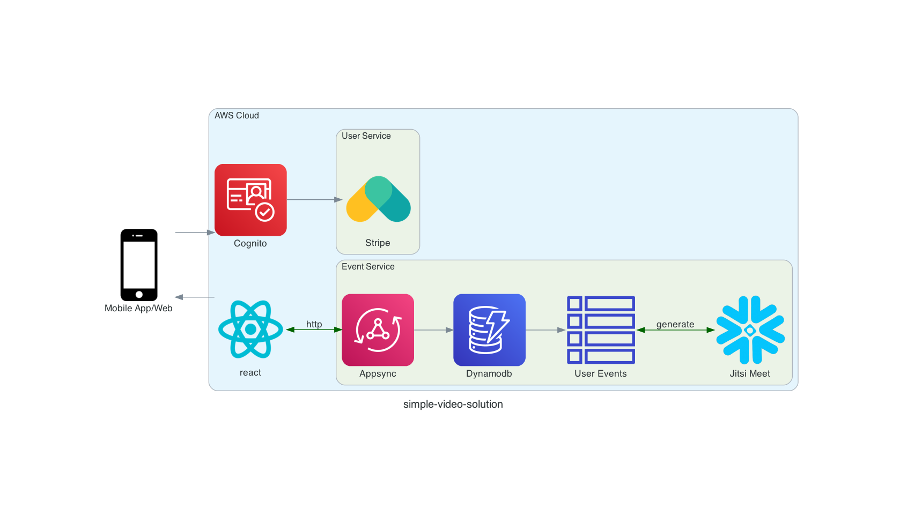
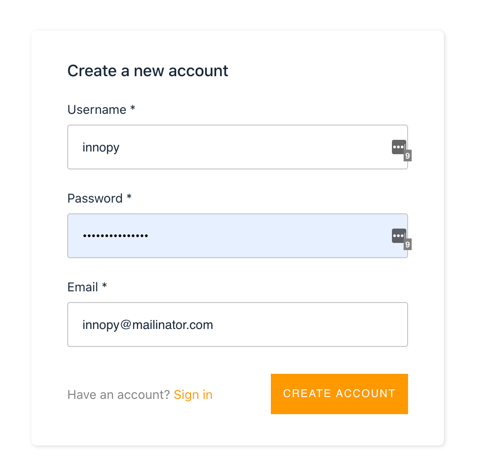
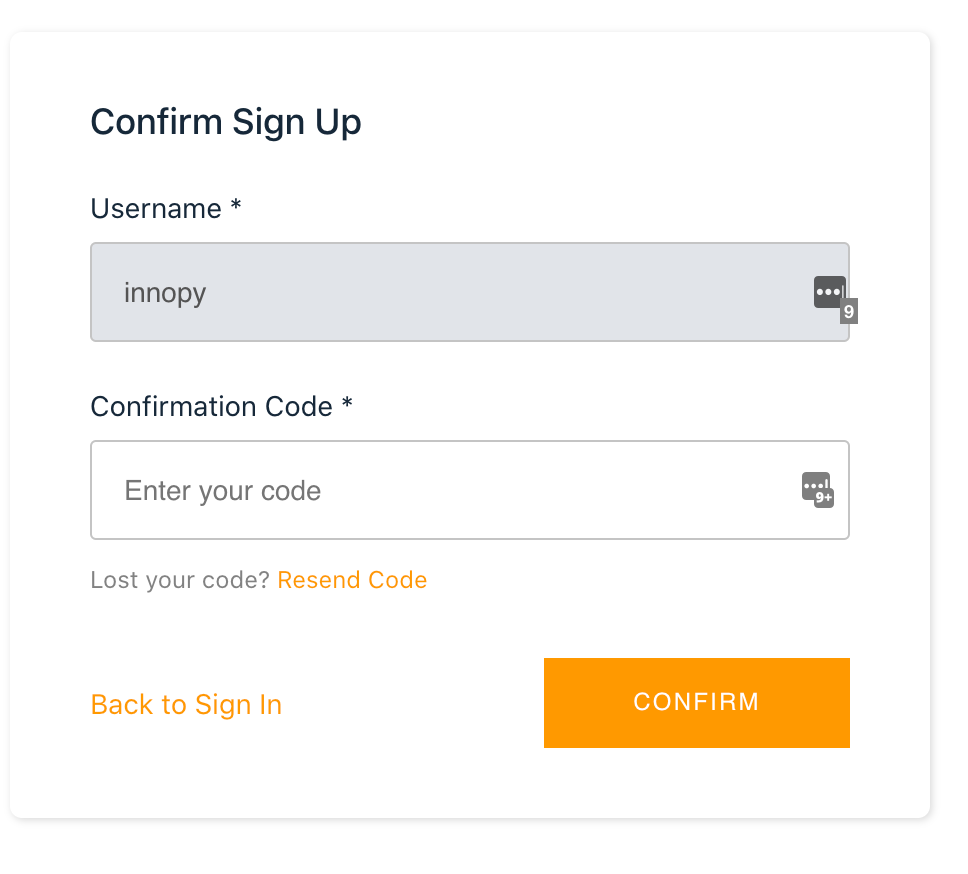
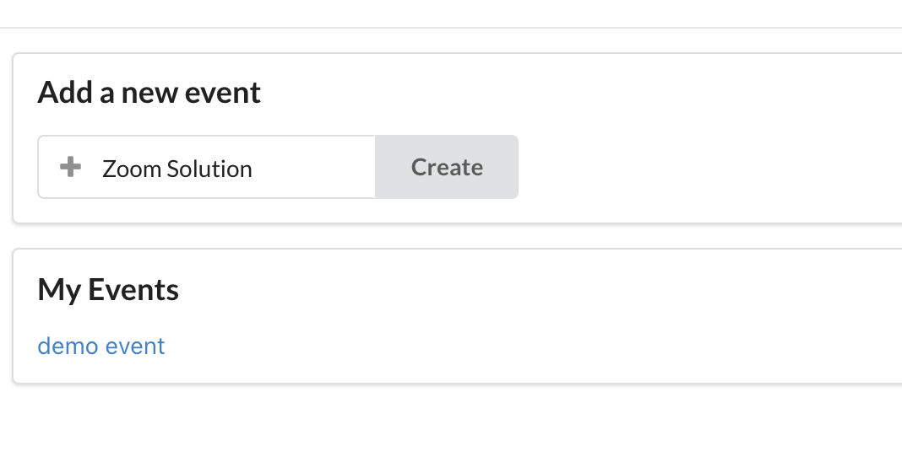
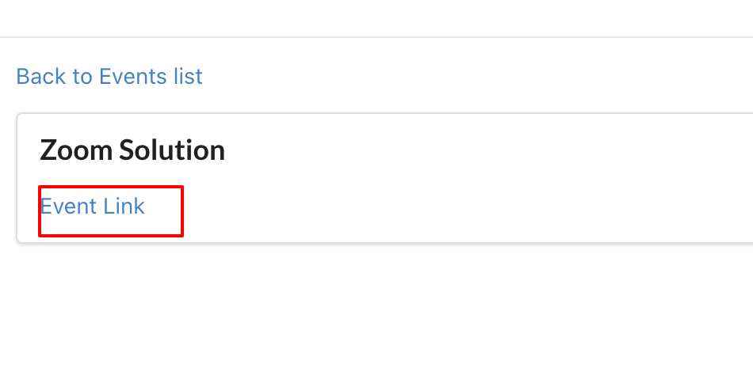
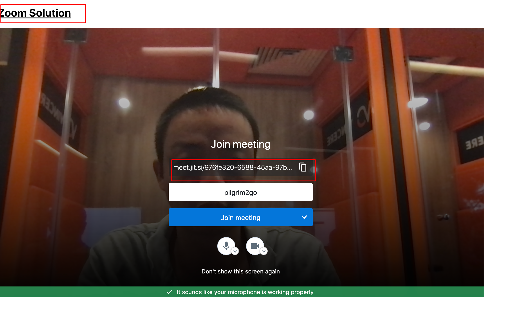

## Architecture

### High-level architecture

This is a high-level view of how the different microservices interact with each other. Each service folder contains anarchitecture diagram with more details for that specific service.

Reference-style: 

### Some screenshots

__User Workflow__

### Technologies used
__Development__:

* [AWS Amplify](https://aws.amazon.com/amplify/) build and deploy secure, scalable full stack applications, powered by AWS

__Communication/Messaging__:

* [AWS AppSync](https://aws.amazon.com/appsync/) for interactions between users and the Video Event platform.

__Authentication/Authorization__:

* [Amazon Cognito](https://aws.amazon.com/cognito/) for managing and authenticating users, and providing JSON web tokens used by services.
* [AWS Identity and Access Management](https://aws.amazon.com/iam/) for service-to-service authorization, either between microservices (e.g. authorize to call an Amazon API Gateway REST endpoint), or within a microservice (e.g. granting a Lambda function the permission to read from a DynamoDB table).

__Hosting__:

* [AWS S3 Website](https://aws.amazon.com/s3/) S3 static website

__Storage__:

* [Amazon DynamoDB](https://aws.amazon.com/dynamodb/) as a scalable NoSQL database for persisting event informations.

### Backend services

|  Services  | Description                               |
|------------|-------------------------------------------|
| [users](amplify/backend/auth/) | Provides user management, authentication and authorization. |
| [events](amplify/backend/api/) | Source of truth for event information. |

### Frontend service

|  Services  | Description                               |
|------------|-------------------------------------------|
| [frontend ](https://github.com/pilgrim2go/video-event-front) | Event Page interacting with Video Services (Jitsi). |

### Demo

https://master.d8evde177bw8j.amplifyapp.com/